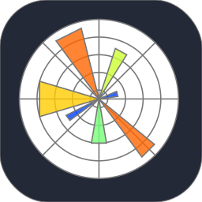

---
 

I'm Maks. I am student of computer science at the Poznan University of Technology. Currently I'm studying topics from data science filed like data analysis, database managment and machine learning.

 

  
  
  
  
  
  
  
  
  
  
  

