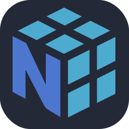

I'm Maks. I am artificial intelligence student at the Poznań University of Technology. Currently I'm studying topics from data science filed like data analysis, database managment and machine learning.

 

  
  
  
  
  
  
  
  
  
  
  
  
  

